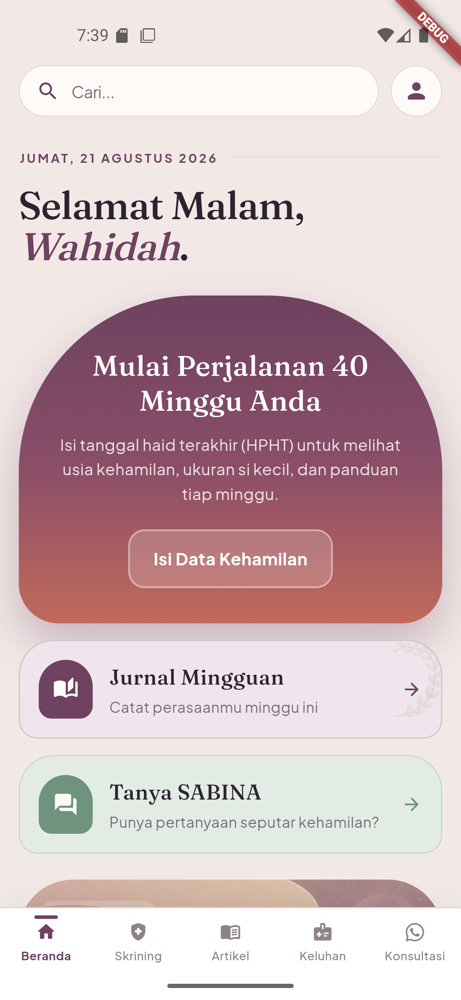
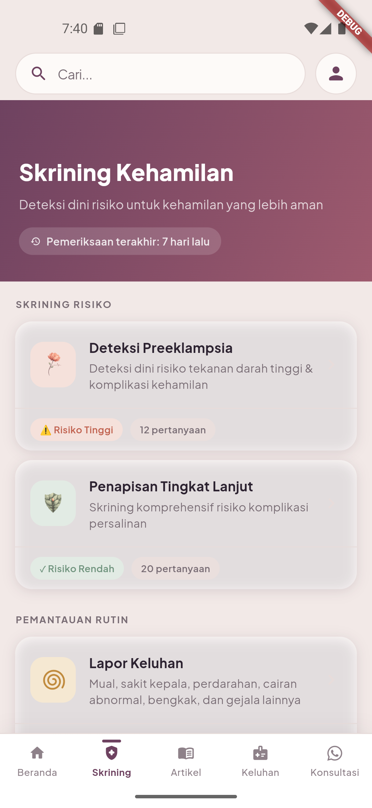
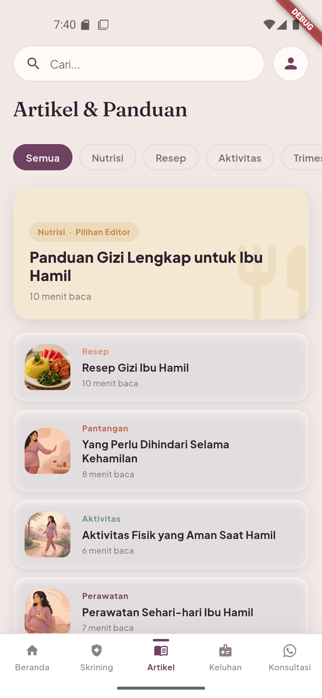
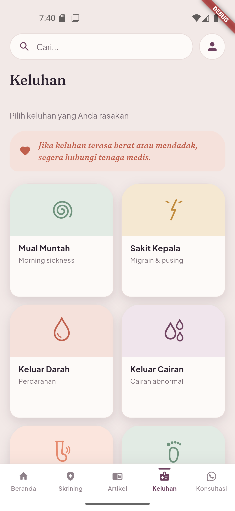
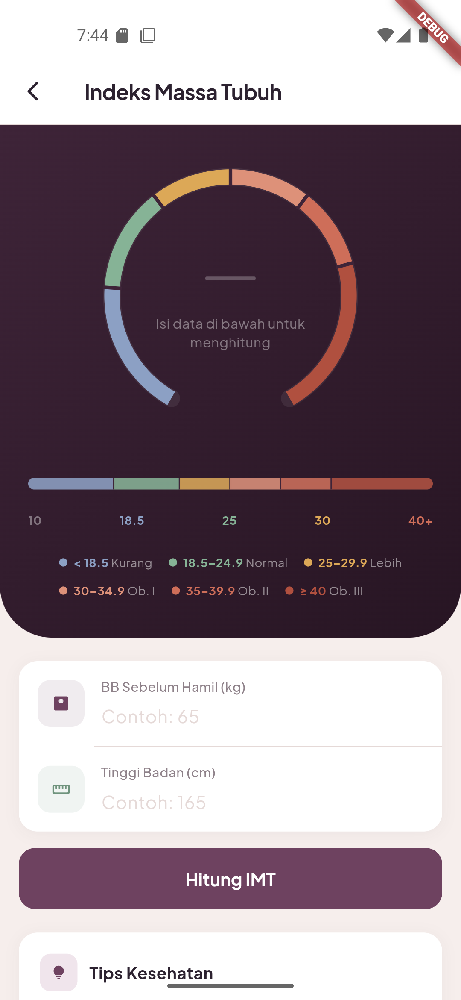
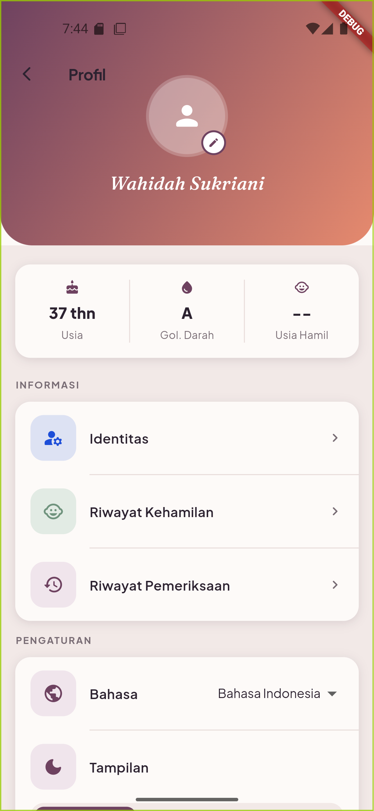
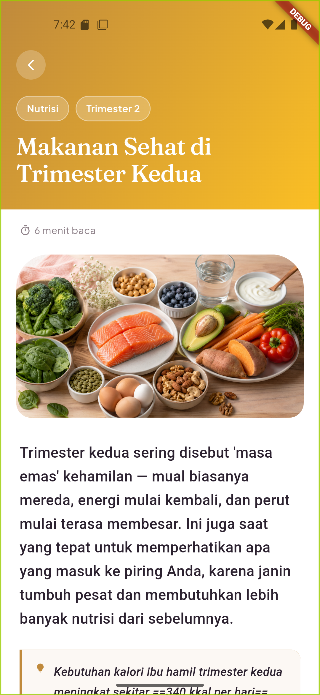
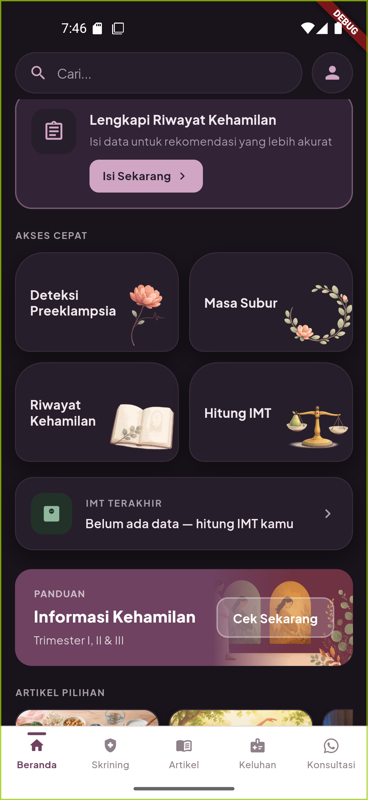

# SABINA - Sahabat Ibu Hamil & Keluarga

   


## 📱 Tentang Aplikasi

SABINA adalah aplikasi edukasi dan skrining mandiri untuk ibu hamil di
Indonesia: skrining risiko, kuesioner keluhan, kalkulator IMT, panduan
trimester, jurnal mingguan, dan artikel edukasi. **Bilingual
(Indonesia/English)** dengan dukungan tema terang & gelap. Seluruh data
tersimpan **lokal di perangkat** — tidak ada server eksternal.

Arah desain: **"jurnal keibuan yang art-directed"** (design system
*Twilight Bloom*), bukan dashboard klinis — menenangkan, hangat, dan personal.

### Visi
Memberikan akses mudah dan terpercaya kepada ibu hamil untuk mencatat
perjalanan kehamilannya sendiri dan berkomunikasi dengan tenaga kesehatan.

### Misi
- Memberikan informasi edukasi kehamilan yang akurat dan evidence-based
- Memfasilitasi komunikasi antara ibu hamil dan tenaga kesehatan
- Membantu deteksi dini faktor risiko lewat skrining mandiri
- Memberdayakan keluarga dalam mendukung kehamilan yang sehat

---

## 📸 Screenshot

| Beranda | Skrining | Artikel |
|---|---|---|
|  |  |  |

| Keluhan | Kalkulator IMT | Profil |
|---|---|---|
|  |  |  |

| Pembaca Artikel | Beranda (Gelap) |
|---|---|
|  |  |

---

## ✨ Fitur Utama

### 1. **Beranda Editorial**
- Masthead sapaan personal (nama dari database) dengan tipografi Fraunces
- Hero lengkung dengan **busur perjalanan 40 minggu** (minggu kehamilan,
  trimester, perkiraan lahir — dihitung real-time dari HPHT)
- Grid bento akses cepat + carousel tips + kartu IMT terakhir

### 2. **Skrining & Deteksi Dini**
- **Skrining Preeklampsia** — 12 pertanyaan faktor risiko
- **Penapisan Faktor Risiko** — kuesioner lengkap risiko kehamilan
- Hasil terakhir per jenis tersimpan otomatis dan tampil di profil

### 3. **Kuesioner Keluhan** (6 jenis)
- Mual & Muntah, Sakit Kepala, Keluar Darah, Keluar Cairan, Bengkak,
  Pergerakan Janin
- Hasil dengan **severity menenangkan**: sage (aman) / amber (perhatian) /
  rust (bahaya) — sengaja tanpa merah menyala agar tidak memicu cemas

### 4. **Riwayat Pemeriksaan & Jurnal Mingguan**
- Setiap hasil skrining/kuesioner tercatat sebagai **timeline berwaktu**
  (dikelompokkan per hari) — bukan hanya hasil terakhir
- Jurnal mingguan: catatan perjalanan kehamilan per minggu

### 5. **Panduan Trimester, Perawatan & Artikel**
- Panduan trimester 1–3, nutrisi, aktivitas fisik, perawatan harian,
  yang perlu dihindari, persiapan persalinan
- Pembaca artikel bergaya editorial (pustaka komponen `article_reader_widgets`)

### 6. **Kalkulator IMT**
- Ring gauge berzona dengan angka Fraunces di tengah
- Kategori & rekomendasi berdasarkan hasil

### 7. **Profil & Identitas**
- Identitas ibu (nama, tanggal lahir, golongan darah, agama, alamat) + foto profil
- Riwayat kehamilan (HPHT, BB/TB, persalinan sebelumnya)
- Pilihan bahasa (ID/EN) & tema (terang/gelap/sistem)

### 8. **Konsultasi**
- Jalur cepat ke tenaga kesehatan via WhatsApp (tab ke-5)

---

## 🎨 Design System — "Twilight Bloom"

Sumber kebenaran: [lib/core/theme/app_theme.dart](lib/core/theme/app_theme.dart).
Widget baru wajib mengambil warna sadar-tema lewat `context.palette`.

### Palet (light)
| Token | Hex | Makna |
|-------|-----|-------|
| `primary` (mulberry) | `#6E4260` | jangkar merek |
| `peach` (koral) | `#E68A6E` | kehidupan/kehangatan |
| `sage` (eukaliptus) | `#6F937D` | sehat/aman |
| `amber` (ochre) | `#C08A3C` | perhatian |
| `critical` (rust) | `#C0604D` | bahaya (bukan merah menyala) |
| `ground` (plaster) | `#F2E9E7` | latar hangat |
| `ink` | `#2C2230` | teks utama |

Dark mode tersedia (`SabinaPalette.dark` + `ThemeProvider`, persist ke
SharedPreferences).

### Tipografi
- **Fraunces** (serif hangat) — sapaan, angka besar, judul editorial
- **Plus Jakarta Sans** — body, label, tombol

### Motif tanda tangan
- **Lengkung/niche (arch)** — sudut atas besar pada hero, tile bento, kartu hasil
- **Busur perjalanan** — busur berzona dengan marker menyala (home & IMT)
- **Ikon Material rounded** — konsisten di seluruh aplikasi (2 pengecualian
  FontAwesome yang disengaja: logo WhatsApp & ikon tempat ibadah netral)

---

## 📋 Struktur Proyek

```
lib/
├── main.dart                     # MultiProvider + MaterialApp (light/dark)
├── core/theme/app_theme.dart     # ⭐ design system (SabinaColors, SabinaPalette)
├── providers/
│   ├── locale_provider.dart      # bahasa ID/EN
│   └── theme_provider.dart       # tema light/dark/system
├── models/                       # model kuesioner + user_identity, pregnancy_history
├── services/
│   ├── database_helper.dart      # SQLite v6: user_identity, pregnancy_history
│   ├── secure_storage_helper.dart# health records terenkripsi
│   ├── screening_result_service.dart # hasil TERAKHIR per jenis skrining
│   ├── history_service.dart      # timeline riwayat pemeriksaan (append)
│   └── journal_service.dart      # jurnal mingguan
├── screens/
│   ├── home_screen.dart          # ⭐ beranda editorial
│   ├── skrining_screen.dart      # hub skrining
│   ├── artikel_screen.dart · artikel/   # daftar + reader artikel
│   ├── keluhan/                  # 6 keluhan × (intro + questionnaire + result)
│   ├── preeclampsia/ · penapisan/
│   ├── trimester/ · care/
│   ├── imt_calculator_screen.dart
│   ├── history_screen.dart       # timeline riwayat pemeriksaan
│   ├── weekly_journal_screen.dart
│   └── user_profile_screen.dart · identity_screen.dart · ...
├── widgets/
│   ├── app_bar.dart              # SabinaAppBar (search pill + profil)
│   ├── bottom_navigation.dart    # 5 tab, active dot, haptic
│   └── article_reader_widgets.dart # ⭐ pustaka komponen artikel
├── utils/constants.dart          # AppAssets
├── l10n/                         # ARB id/en (template: id)
└── generated/                    # AppLocalizations hasil gen-l10n
test/                             # widget & unit test (IMT, model, smoke)
```

---

## 🔧 Setup & Menjalankan

### Prasyarat
- Flutter 3.41.x (stable) · Dart 3.11
- Android SDK (AGP 8.9, Gradle 8.11)

```bash
# 1. Install dependencies
flutter pub get

# 2. Generate lokalisasi (bila ARB berubah)
flutter gen-l10n

# 3. Jalankan
flutter run

# 4. Analisis & test (wajib 0 issues sebelum commit)
flutter analyze
flutter test
```

### Build Rilis (Play Store)
Versi aplikasi bersumber tunggal dari `pubspec.yaml`. Signing membaca
`android/key.properties` (salin dari `android/key.properties.example`, isi
kredensial — file ini di-`.gitignore`, jangan pernah di-commit). Tanpa
`key.properties`, build rilis memakai debug signing (untuk uji lokal saja).

```bash
flutter build appbundle --release
```

### Dependensi Utama
`provider` · `sqflite` · `shared_preferences` · `flutter_secure_storage` ·
`google_fonts` (Fraunces + Plus Jakarta Sans) · `image_picker` ·
`url_launcher` · `fl_chart` / `syncfusion_flutter_charts` · `photo_view` ·
`carousel_slider` — versi lengkap lihat [pubspec.yaml](pubspec.yaml).

---

## 📝 Catatan Pengembangan

### Penyimpanan Data
| Data | Storage | Keterangan |
|------|---------|-----------|
| Identitas user | SQLite (`user_identity`) | nama, tgl lahir, gol darah, agama, alamat |
| Riwayat kehamilan | SQLite (`pregnancy_history`) | HPHT, BB, TB, riwayat persalinan |
| Hasil skrining terakhir | SharedPreferences | JSON per jenis + severity + timestamp |
| Timeline riwayat pemeriksaan | SharedPreferences (`history_entries`) | append, multi-entri |
| Jurnal mingguan | SharedPreferences | via `journal_service` |
| Health records / kontak darurat | SecureStorage | terenkripsi (Keychain/Keystore) |
| Foto profil | App documents dir | path di SharedPreferences |

### Hal Penting
- **Usia kehamilan & usia user dihitung real-time** dari HPHT / tanggal lahir
- **Jangan hardcode teks berbahasa di UI** — selalu tambah key ARB (id & en)
  lalu `flutter gen-l10n`
- **Jangan rename/hapus token `SabinaColors.*` lama** — ratusan referensi;
  cukup ubah nilainya
- `answerQuestion` berbeda per model: `bool` (preeklampsia, penapisan, mual,
  sakit kepala, darah, bengkak) vs `String 'Ya'/'Tidak'` (pergerakan janin,
  keluar cairan)

### Pending
- [ ] Migrasi dark mode per-layar (banyak layar masih hardcode warna light)
- [ ] `notification_service.dart` masih stub — reminder belum berfungsi
- [ ] Optimasi ukuran aset gambar (kandidat WebP)

Panduan pengembangan lengkap: [CLAUDE.md](CLAUDE.md).

---

## 🔐 Keamanan & Privasi

- Seluruh data pengguna tersimpan **lokal di perangkat** (SQLite /
  SharedPreferences / SecureStorage terenkripsi)
- **Tidak ada data yang dikirim ke server eksternal**
- Kredensial signing tidak pernah di-commit (`android/key.properties`)

Lihat [PRIVACY_POLICY.md](PRIVACY_POLICY.md) dan
[TERMS_OF_SERVICE.md](TERMS_OF_SERVICE.md) untuk detail.

---

## 📞 Dukungan & Kontak

- **Content Expert & Kontak Privasi**: Bdn. Wahidah Sukriani — wahidahsukriani@gmail.com
- **Lead Developer**: Presley — presleyfelly@gmail.com

---

---

## 📋 Persyaratan Sistem

- Android 5.0 (Lollipop) ke atas · RAM 2 GB · penyimpanan ±150 MB
- Tidak memerlukan koneksi internet untuk seluruh fitur inti (offline-first)

## 🔬 Referensi Ilmiah & Standar

Konten edukasi dan skrining disusun serta **ditinjau langsung oleh
Bdn. Wahidah Sukriani, S.ST., M.Keb.** (dosen kebidanan Poltekkes Kemenkes
Palangka Raya) sebagai content expert, merujuk pada:
- Sukriani, W. — *Asuhan Kebidanan Kehamilan* (2022); *Buku Ajar Asuhan
  Persalinan & Bayi Baru Lahir* (2023); *Asuhan Kebidanan Pada Nifas*
  (2023); *KB dan Kesehatan Reproduksi* (2023); *Asuhan Holistik Masa
  Nifas dan Menyusui* (2024)
- Pedoman ANC Kementerian Kesehatan RI; rujukan internasional pada artikel
  (ACOG, WHO, NHS — tercantum di tiap artikel)
- Fitur "Tanya SABINA": 72 jawaban terkurasi, tervalidasi ahli dua putaran
  (dokumentasi validasi: `kurasi/validasi_checklist.md`)

## 👥 Tim Pengembang

- **Content Expert**: Bdn. Wahidah Sukriani, S.ST., M.Keb. —
  [sapabidan.com](https://sapabidan.com)
- **Pengembang**: Presley

## ⚠️ Disclaimer Medis

SABINA adalah **alat bantu edukasi dan deteksi dini**, BUKAN alat
diagnosis. Hasil skrining, kuesioner, dan jawaban Tanya SABINA bersifat
informatif dan tidak menggantikan pemeriksaan tenaga kesehatan. Untuk
kondisi darurat, segera hubungi fasilitas kesehatan terdekat. Lihat
[PRIVACY_POLICY.md](PRIVACY_POLICY.md) & [TERMS_OF_SERVICE.md](TERMS_OF_SERVICE.md).

**Dibuat dengan ❤️ untuk ibu hamil di Indonesia**

*Last Updated: Juli 2026 — v1.1.0 (versionCode 47)*
